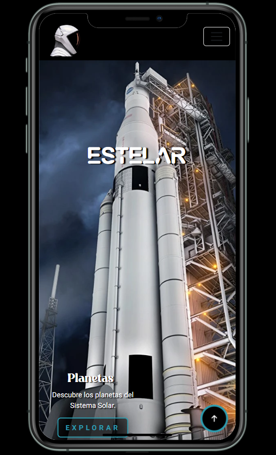
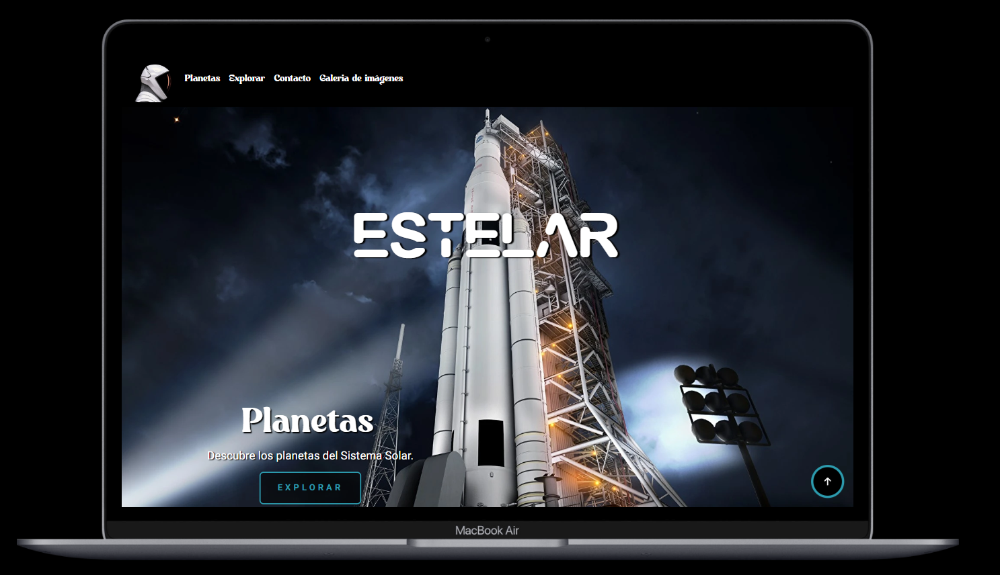
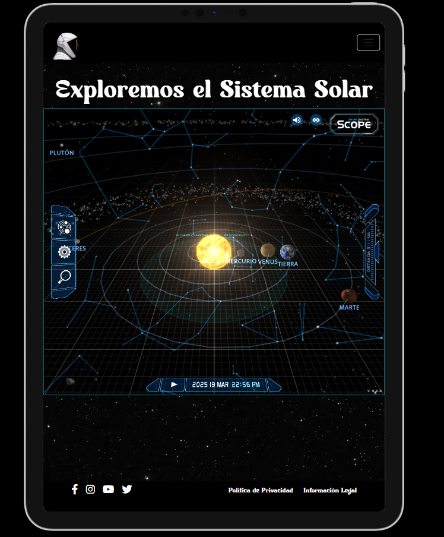

# 🌌 Estelar - Explorando el Sistema Solar 🚀

**Estelar** es una página web informativa sobre el Sistema Solar que incluye:
- 📖 Información detallada sobre cada planeta
- 🖼️ Una galería interactiva de imágenes
- 🎮 Un juego educativo sobre el espacio

## 📸 Vistas de la Página

### 📱 Vista Mobile

### 💻 Vista Desktop

### 📟 Vista iPad

## 🚀 Características

✅ Diseño responsive adaptable a distintos dispositivos  
✅ Contenido educativo sobre los planetas del Sistema Solar  
✅ Interactividad con imágenes y juegos  

